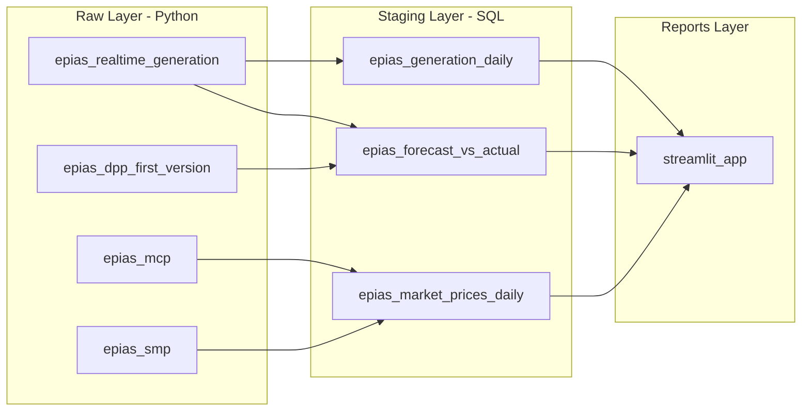

# EPIAS Energy Market Pipeline

## Architecture




## Directory Structure

```
epias-energy/
├── pipeline.yml
└── assets/
    ├── raw/
    │   ├── requirements.txt
    │   ├── epias_realtime_generation.py
    │   ├── epias_dpp_first_version.py
    │   ├── epias_mcp.py
    │   └── epias_smp.py
    ├── staging/
    │   ├── epias_generation_daily.sql
    │   ├── epias_forecast_vs_actual.sql
    │   └── epias_market_prices_daily.sql
    └── reports/
        ├── requirements.txt
        └── streamlit_app.py
```

## EPIAS API Authentication

Every Python asset needs a TGT (Ticket Granting Ticket) for API access. Credentials are in `[.bruin.yml](.bruin.yml)` as generic secrets (`epias_username`, `epias_password`), accessible via `os.environ` in Bruin Python assets.

```python
def get_tgt():
    url = "https://giris.epias.com.tr/cas/v1/tickets"
    data = f"username={os.environ['epias_username']}&password={os.environ['epias_password']}"
    headers = {"Content-Type": "application/x-www-form-urlencoded", "Accept": "text/plain"}
    resp = requests.post(url, data=data, headers=headers)
    resp.raise_for_status()
    return resp.text.strip()
```

API calls use `POST` with JSON body, TGT in header, dates in ISO-8601 Turkish timezone (`2025-03-03T00:00:00+03:00`).

## Pipeline Config

- **Pipeline name**: `epias-energy`
- **Schedule**: `daily`
- **Start date**: `"2025-03-01"`
- **Default connection**: `bruin-playground-arsalan`

## Raw Layer (4 Python Assets)

All assets share the same patterns: `get_tgt()` auth, daily chunked API calls for the past year, `extracted_at` timestamp, `create+replace` materialization, retry with exponential backoff.

### 1. `epias_realtime_generation.py` — `raw.epias_realtime_generation`

- **Endpoint**: `POST /v1/generation/data/realtime-generation`
- **Body**: `{startDate, endDate}` (no powerPlantId = aggregate by source)
- **Response fields**: `date`, `hour`, `naturalGas`, `wind`, `lignite`, `geothermal`, `importCoal`, `fueloil`, `dammedHydro`, `naphta`, `biomass`, `river`, `sun`, `importExport`, `total`, etc.
- **Schema**: ~15 source columns + date/hour + extracted_at
- **Primary key**: composite of `date` + `hour`
- Answers **Q1** (energy by source) and provides actual data for **Q3**

### 2. `epias_dpp_first_version.py` — `raw.epias_dpp_first_version`

- **Endpoint**: `POST /v1/generation/data/dpp-first-version`
- **Body**: `{startDate, endDate, region: "TR1"}` (region required)
- **Response fields**: Same source breakdown as realtime-generation
- Provides day-ahead forecast data for **Q3** (predicted vs actual)

### 3. `epias_mcp.py` — `raw.epias_mcp`

- **Endpoint**: `POST /v1/markets/dam/data/mcp`
- **Body**: `{startDate, endDate}`
- **Response fields**: `date`, `hour`, `price` (TRY), `priceEur`, `priceUsd`
- Market Clearing Price for dashboard context

### 4. `epias_smp.py` — `raw.epias_smp`

- **Endpoint**: `POST /v1/markets/bpm/data/system-marginal-price`
- **Body**: `{startDate, endDate}`
- **Response fields**: `date`, `hour`, `systemMarginalPrice`, `smpDirection`
- System Marginal Price for dashboard context

## Staging Layer (3 SQL Assets)

### 1. `epias_generation_daily.sql` — `staging.epias_generation_daily`

- Depends on: `raw.epias_realtime_generation`
- Aggregates hourly data to daily totals by source
- Adds derived fields: year, month, season, day_of_week, source rankings
- Pivots source columns into rows for easier charting (source_name, generation_mwh)

### 2. `epias_forecast_vs_actual.sql` — `staging.epias_forecast_vs_actual`

- Depends on: `raw.epias_realtime_generation`, `raw.epias_dpp_first_version`
- Joins DPP forecast with actual generation by date/hour/source
- Computes: forecast_error_mwh, forecast_error_pct, absolute_error
- Aggregates to daily level per source

### 3. `epias_market_prices_daily.sql` — `staging.epias_market_prices_daily`

- Depends on: `raw.epias_mcp`, `raw.epias_smp`
- Daily min/max/avg/median for MCP and SMP
- Price spread (SMP - MCP)

## Reports Layer

### `streamlit_app.py`

- **Page 1**: Energy generation by source (stacked area/bar chart, source breakdown pie)
- **Page 2**: Forecast vs Actual (line chart overlay, error distribution)
- **Page 3**: Market prices (MCP/SMP time series, spread analysis)
- Uses Altair with `HIGHLIGHT = "#D55E00"`, `DEFAULT = "#56B4E9"` palette
- Loads data via BigQuery client with `st.secrets["gcp_service_account"]`

## Testing Strategy

1. Validate pipeline: `bruin validate epias-energy/`
2. Test each raw asset individually: `bruin run epias-energy/assets/raw/<asset>`
3. Verify data in BigQuery after each raw asset run
4. Test staging assets after raw data is loaded
5. Run full pipeline: `bruin run epias-energy/`

