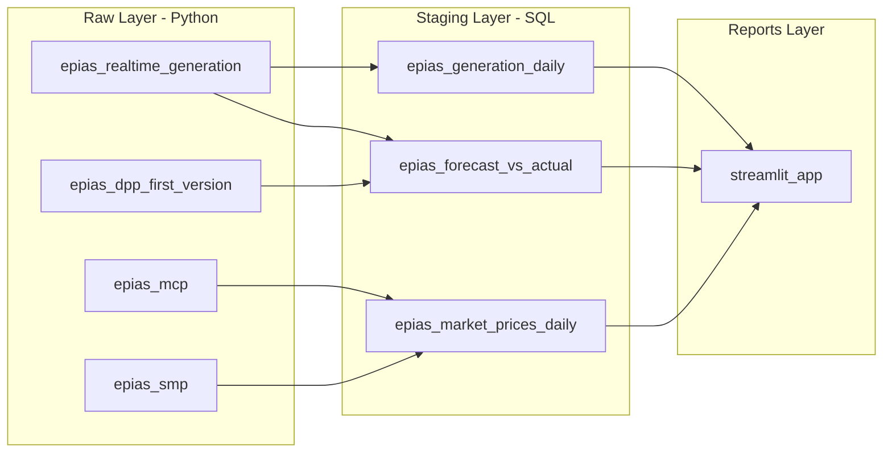

# EPIAS Energy Market Pipeline

## Architecture



## Directory Structure

```
epias-energy/
├── pipeline.yml
└── assets/
    ├── raw/
    │   ├── requirements.txt
    │   ├── epias_realtime_generation.py
    │   ├── epias_dpp_first_version.py
    │   ├── epias_mcp.py
    │   └── epias_smp.py
    ├── staging/
    │   ├── epias_generation_daily.sql
    │   ├── epias_forecast_vs_actual.sql
    │   └── epias_market_prices_daily.sql
    └── reports/
        ├── requirements.txt
        └── streamlit_app.py
```

## Pipeline Config

- **Pipeline name**: `epias-energy`
- **Schedule**: `daily`
- **Start date**: `"2025-03-01"`
- **Default connection**: `bruin-playground-arsalan`
- **Datasets**: `epias_raw` (raw layer), `epias_staging` (staging layer)

## Current State (as of 2026-04-16)

### Data Loaded
| Table | Rows | Date Range |
|---|---|---|
| `epias_raw.epias_realtime_generation` | 102,278 | 2015-01-01 → 2026-04-16 |
| `epias_raw.epias_dpp_first_version` | 102,120 | 2015-01-01 → 2026-04-17 |
| `epias_raw.epias_mcp` | 102,312 | 2015-01-01 → 2026-04-17 |
| `epias_raw.epias_smp` | 101,952 | 2015-01-01 → 2026-04-03 |
| `epias_staging.epias_generation_daily` | 49,320 | 2015-01-01 → 2026-03-31 |
| `epias_staging.epias_forecast_vs_actual` | 41,100 | 2015-01-01 → 2026-03-31 |
| `epias_staging.epias_market_prices_daily` | 4,110 | 2015-01-01 → 2026-03-31 |

### Known Issues & Fixes Applied
- **SMP endpoint 400 on recent dates**: Last ~3 weeks of SMP data unavailable from API. Asset gracefully skips failed chunks and returns collected data.
- **Mixed timezones pre-2016**: Turkey switched from DST (UTC+2/+3) to permanent UTC+3 in 2016. All raw assets use `pd.to_datetime(utc=True)` to handle mixed offsets.
- **Incomplete months excluded**: All staging SQL assets filter with `WHERE date < DATE_TRUNC(CURRENT_DATE(), MONTH)`.
- **Auth returns 201**: EPIAS TGT endpoint returns HTTP 201 (not 200) on success. The `get_tgt()` error log fires but the TGT is valid. Cosmetic issue.

## EPIAS API Authentication

Every Python asset uses a TGT (Ticket Granting Ticket) for API access. Credentials are in `.bruin.yml` as generic secrets (`epias_username`, `epias_password`), accessible via `os.environ` in Bruin Python assets.

API calls use `POST` with JSON body, TGT in header, dates in ISO-8601 Turkish timezone (`2025-03-03T00:00:00+03:00`). All assets chunk requests in 30-day windows with retry + exponential backoff for 429/502/503.

## Raw Layer (4 Python Assets)

All assets share: `get_tgt()` auth, 30-day chunked API calls, `extracted_at` timestamp, `create+replace` materialization, retry with exponential backoff, `utc=True` datetime parsing.

### 1. `epias_realtime_generation.py` → `epias_raw.epias_realtime_generation`
- **Endpoint**: `POST /v1/generation/data/realtime-generation`
- **Body**: `{startDate, endDate}` (no powerPlantId = aggregate by source)
- **Schema**: ~13 source columns (natural_gas, wind, solar, lignite, hard_coal, fuel_oil, geothermal, dammed_hydro, river, biomass, naphta, import_export, total) + date + extracted_at

### 2. `epias_dpp_first_version.py` → `epias_raw.epias_dpp_first_version`
- **Endpoint**: `POST /v1/generation/data/dpp-first-version`
- **Body**: `{startDate, endDate, region: "TR1"}`
- Same source breakdown as realtime-generation; provides day-ahead forecast data

### 3. `epias_mcp.py` → `epias_raw.epias_mcp`
- **Endpoint**: `POST /v1/markets/dam/data/mcp`
- **Schema**: date, price_try, price_eur, price_usd, extracted_at

### 4. `epias_smp.py` → `epias_raw.epias_smp`
- **Endpoint**: `POST /v1/markets/bpm/data/system-marginal-price`
- **Schema**: date, smp, smp_direction, extracted_at
- Gracefully handles 400 errors on recent date chunks

## Staging Layer (3 SQL Assets)

All staging assets filter out the current incomplete month.

### 1. `epias_generation_daily.sql` → `epias_staging.epias_generation_daily`
- Depends on: `epias_raw.epias_realtime_generation`
- Unpivots wide → long (source_name, generation_mwh), aggregates hourly → daily
- Adds: share_pct, year, month, season, day_of_week

### 2. `epias_forecast_vs_actual.sql` → `epias_staging.epias_forecast_vs_actual`
- Depends on: `epias_raw.epias_realtime_generation`, `epias_raw.epias_dpp_first_version`
- Full outer join forecast vs actual by date/source
- Computes: error_mwh, abs_error_mwh, error_pct

### 3. `epias_market_prices_daily.sql` → `epias_staging.epias_market_prices_daily`
- Depends on: `epias_raw.epias_mcp`, `epias_raw.epias_smp`
- Daily min/max/avg for MCP (TRY, EUR, USD) and SMP
- Spread (SMP - MCP), surplus/deficit hour counts

## Reports Layer — Streamlit Dashboard

**URL**: `streamlit run epias-energy/assets/reports/streamlit_app.py`
**Auth**: Application Default Credentials (gcloud ADC), no secrets.toml needed.
**Palette**: Tableau Colorblind 10 (CVD-safe), with stroke dash patterns on line charts.

### Tab 1: Generation by Source
- **Turkey Electricity Generation by Source (2015–2025)** — yearly stacked bar by source (excludes incomplete first/last years)
- **Annual Generation Mix by Source Category** — stacked % bar (Solar, Wind, Hydro, Geothermal, Biomass, Non-Renewables)
- **Renewable vs Fossil Fuel Share Over Time** — binary stacked % bar (includes 2026)
- **Renewable Generation by Source (TWh per Year)** — line chart with dash patterns
- **Each Renewable Source as % of Total Electricity Produced** — line chart with dash patterns
- KPI metrics: Total TWh, Top Source, Renewable Share %

### Tab 2: Forecast vs Actual
- **Day-Ahead Forecast Accuracy** — monthly forecast vs actual line overlay
- **Average Forecast Error by Energy Source** — horizontal bar (over/under forecast)
- KPI metrics: Mean Error %, Mean Abs Error, MAPE

### Tab 3: Market Prices
- **Day-Ahead (MCP) vs Balancing Market (SMP) Prices** — daily time series
- **Daily Balancing Cost Premium (SMP - MCP)** — diverging bar chart
- **Monthly Average MCP vs SMP** — grouped bar chart
- KPI metrics: Avg MCP, Avg SMP, Avg Spread

## Phase 2: Socioeconomic Cross-Analysis

### Hypotheses to Test

**H1: "When the Lira crashes, Turkey burns more coal"**
- Mechanism: Turkey imports gas priced in USD. TRY depreciation makes gas plants expensive → generation shifts to domestic lignite.
- Data needed: Daily TRY/USD from EVDS (Central Bank of Turkey) or FRED. Already have generation mix from EPIAS.
- Cross-ref: Hormuz Effect pipeline has Brent/WTI/natural gas prices from FRED.

**H2: "Turkey's droughts are hidden electricity crises"**
- Mechanism: Hydro is the largest renewable source. Drought reduces hydro output → replaced by gas/coal → MCP spikes.
- Data needed: ERA5 climate reanalysis (Copernicus CDS API) for Turkey precipitation and temperature.
- Test: 3-6 month cumulative precipitation deficit predicts hydro share decline and MCP increase.

**H3: "Geopolitical risk in the Strait of Hormuz is already priced into Turkey's electricity"**
- Mechanism: Global LNG prices (partly driven by Hormuz risk) affect Turkey's gas contract prices → flows into MCP.
- Data needed: Polymarket Iran/Hormuz probability (already in repo) + EPIAS MCP in EUR.
- Cross-ref: Polymarket Insights pipeline has price history for top 50 markets.

**H4: "Turkey's renewable growth is demand-driven, not policy-driven"**
- Mechanism: Renewable capacity additions may correlate more with GDP growth and urbanization than policy milestones.
- Data needed: World Bank GDP per capita and urbanization (already in Baby Bust pipeline) + EPIAS generation trends.
- Cross-ref: Baby Bust pipeline has World Bank indicators for Turkey (1960-2024).

### External Data Sources Identified
| Source | API/URL | Data | Auth |
|---|---|---|---|
| EVDS (Central Bank of Turkey) | `evds3.tcmb.gov.tr` | Daily TRY/USD, interest rates | Free API key |
| Copernicus ERA5 | `cds.climate.copernicus.eu` | Hourly/daily weather reanalysis | Free account |
| TurkStat (TUIK) | `data.tuik.gov.tr` | Industrial production index (monthly) | None (CSV) |
| World Bank API | `api.worldbank.org` | GDP, urbanization, manufacturing | None |
| FRED (via Hormuz pipeline) | Already in repo | Oil/gas prices, CPI | Already configured |
| Polymarket (via pipeline) | Already in repo | Geopolitical prediction markets | Already configured |
| Baby Bust (via pipeline) | Already in repo | World Bank demographic indicators | Already configured |

## Testing

```bash
# Validate
bruin validate epias-energy/

# Run full pipeline (2015 to present)
bruin run --start-date 2015-01-01 --end-date $(date +%Y-%m-%d) epias-energy/

# Run single asset
bruin run epias-energy/assets/raw/epias_mcp.py

# Launch dashboard
python3 -m streamlit run epias-energy/assets/reports/streamlit_app.py
```
